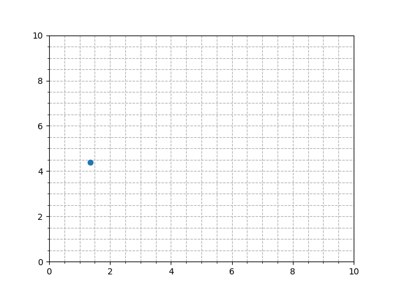
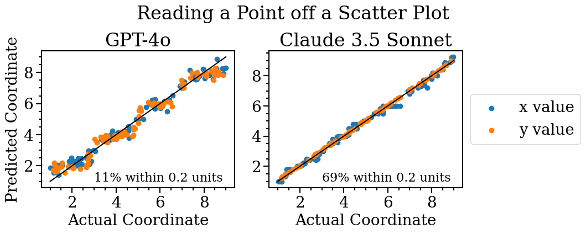
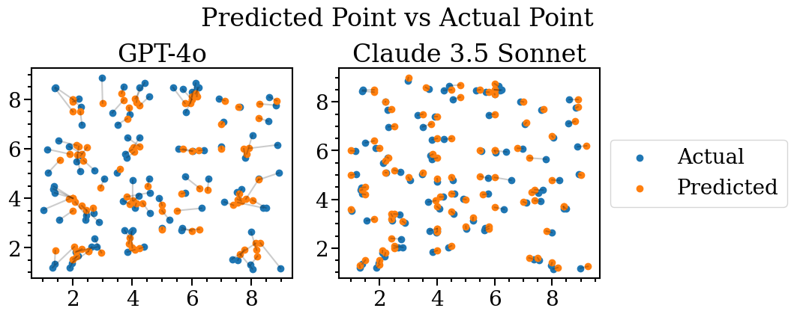
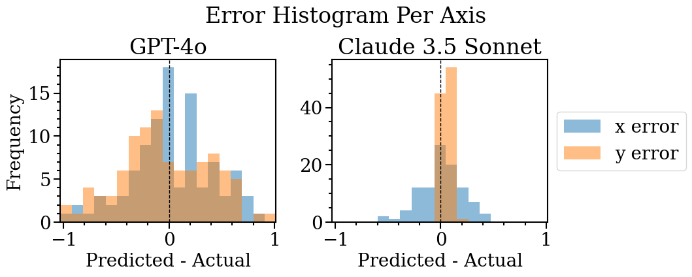

### PointBench: What's the position of the point?

This is a simple benchmark that tests if a model can visually determine the position of a point from a scatter plot. This is a fundamental skill that models should master before they can be used for more complex tasks, like analyzing scientific plots.

#### Benchmark Generation

Decimal coordinates ($x,y$) are chosen randomly from 1.0 to 9.0 and 100 plots are generated.

Here is an example plot with point (1.345, 4.379). Looking at this plot, I measured (1.35, 4.4) which is off by 0.11 units in Euclidean distance. Humans should be able to measure the point position within 0.2 units 100% of the time. Let's see how AI models do!



#### AI Evaluation

I evaluated GPT-4o and Claude 3.5 Sonnet. The top two SOTA models for vision tasks. I prompted with:

```
What is the position of this point? Output your answer in the format (x,y). E.g. (5.06,4.23).
Be as precise as possible. Answer to 2 decimal places. 
These points are truly random so do not output whole numbers, try to use the decimals. 
Only output your answer in the format (x,y). Nothing else.
```

Note: I did a bit of prompt engineering to provide context and avoid errors associated with extracting the answer from the response. Different prompts will likely yield different results.

#### Results

| Model | % within 0.2 units | Median Euclidean Distance (units) | Mean Absolute x Error (units) | Mean Absolute y Error (units) |
|-------|--------------------|---------------------------|-----------------------|-----------------------|
| Claude 3.5 Sonnet | **69%** | 0.14 | 0.15 | 0.06 |
| GPT-4o | 11% | 0.48 | 0.30 | 0.35 |

Claude 3.5 Sonnet is much better than GPT-4o! GPT-4o seems to be biased for numbers closer to the y tick labels (2, 4, 6, and 8).





#### Discussion

More ticks and gridlines can increase GPT-4o's accuracy, but real-world plots won't have these features. I am unsure if few-shot learning or prompting will help GPT-4o in this case. Claude 3.5 Sonnet clearly has better architecture/training data for this task.

The fact that Claude 3.5 Sonnet performs significantly worse for predicting $x$ over $y$ is interesting and could provide insight into how tokenized images are fed into the model. This effect is not seen in GPT-4o, which performs equally bad for both $x$ and $y$.


I am not an expert on this, but here is some speculation. These differences between GPT-4o and Claude might suggest different architectures (early-fusion vs a grafted on image encoder). If Claude 3.5 Sonnet tokenizes in a raster-order, top-left to bottom-right row by row like reading, then the tokens containing the $y$-axis ticks/labels will be a row-length apart and the tokens containing the $x$-axis ticks/labels will all together in the same row. Perhaps having all the $x$-axis tokens together in the same row makes their positional encodings very similar, so the model struggles to have attention differentiate between them.

